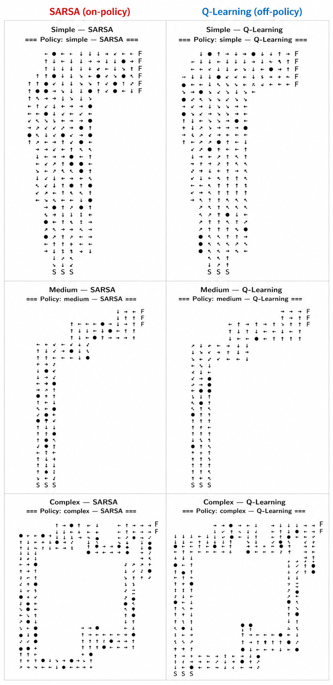

# Does Algorithm Choice Matter?
### How Racetrack Complexity Modulates the Performance Gap Between SARSA and Q-Learning

**Group 16** · [GitHub Repository](https://github.com/sdrxjl/RL_finalproj)

---

## Executive Summary

This project asks whether the choice between on-policy SARSA and off-policy Q-Learning becomes more consequential as the Racetrack environment grows more complex. We designed three tracks of increasing difficulty — Simple (L-shape, 1 turn), Medium (S-shape, 2 turns), Complex (circuit, 5+ turns) — and trained both algorithms under identical conditions (ε = 0.1, γ = 1.0, α = 0.5, 40,000 episodes). The performance gap grows monotonically with complexity: Q-Learning outperforms SARSA by 3.9 pp on Simple, 8.2 pp on Medium, and 24.0 pp on Complex, where SARSA fails to finish in over one-third of evaluations due to oscillation loops. Q-Learning's learned policy maintains a clear directional gradient toward the finish on all tracks; SARSA's degrades into corner paralysis on complex layouts.

---

## Problem Formulation and Final MDP

The Racetrack is a 2-D grid with cell values: wall (0), track (1), start (2), finish (3). A **state** is (row, col, vel_row, vel_col) with velocities in [0, 4], giving state space R × C × 5 × 5. The agent starts at (v_y = 2, v_x = 0) to reflect an agent already in motion.

- **Actions:** 9 tuples (Δv_row, Δv_col) ∈ {−1, 0, +1}²
- **Reward:** −1 per step, 0 at finish. With γ = 1.0 this directly minimizes path length.
- With probability 0.1 the intended acceleration is ignored (stochastic noise).
- Wall collisions reset position; episodes end at the finish or after 1,000 steps.

The MDP is consistent with the course assignment; the key extension is adding Medium and Complex tracks to study complexity effects.

---

## Algorithmic Methodology

We compare two tabular TD methods that differ only in their bootstrap target.

**SARSA (on-policy):**

$$Q(s,a) \leftarrow Q(s,a) + \alpha[r + \gamma Q(s',a') - Q(s,a)]$$

where a′ follows the same ε-greedy policy. On-policy updates absorb exploratory noise into Q-values, making SARSA conservative near risky states.

**Q-Learning (off-policy):**

$$Q(s,a) \leftarrow Q(s,a) + \alpha\left[r + \gamma\max_{a'}Q(s',a') - Q(s,a)\right]$$

The max operator decouples exploration from value estimation, allowing Q-Learning to discover shorter, more aggressive paths.

Both use fixed ε = 0.1 throughout — no decay — so any performance gap is attributable solely to the on-policy vs. off-policy distinction.

### Hyperparameters (identical across all algorithm–track combinations)

| Parameter | Value | Parameter | Value |
|-----------|-------|-----------|-------|
| α | 0.5 | Episodes | 40,000 |
| γ | 1.0 | Max steps | 1,000 |
| ε | 0.1 (fixed) | Eval freq | every 50 ep (800 checkpoints) |
| Seed | 0 | Init Q | 0.0 |

---

## Experimental Results and Performance Evaluation

At each of 800 checkpoints a deterministic greedy rollout from (v_y = 2, v_x = 0) is classified as *finished*, *looped* (oscillation detected), or *timeout*. A random policy achieves ≈0% finish rate on all tracks, confirming genuine learning is required.

### Greedy Evaluation Across 800 Checkpoints

| Track | Algorithm | Finish | Loop | Avg Steps | Gap |
|-------|-----------|--------|------|-----------|-----|
| Simple | SARSA | 90.1% | 9.9% | 16.9 | — |
| Simple | Q-Learning | 94.0% | 6.0% | 14.3 | +3.9 pp |
| Medium | SARSA | 85.9% | 14.1% | 25.2 | — |
| Medium | Q-Learning | 94.1% | 5.9% | 18.9 | +8.2 pp |
| Complex | SARSA | 65.2% | 34.8% | 44.2 | — |
| Complex | Q-Learning | 89.2% | 10.8% | 28.6 | +24.0 pp |

*Gap = Q-Learning minus SARSA finish rate.*

The gap grows monotonically: +3.9 pp → +8.2 pp → +24.0 pp. SARSA's loop rate rises from 9.9% to 34.8% across tracks; Q-Learning's rises only from 6.0% to 10.8%.

The figure below shows the smoothed online return during training. On Simple and Medium tracks both algorithms converge quickly and comparably. On the Complex track the divergence is stark: Q-Learning (blue) converges smoothly to a high steady-state return, while SARSA (red) remains volatile throughout, with persistent return drops indicating repeated wall collisions near corners even late in training.

*Smoothed online episode return during training (window = 50). On the Complex track SARSA (red) remains volatile and converges to a lower return than Q-Learning (blue), while both algorithms perform comparably on the Simple track.*

---

## Analysis and Interpretation

### Interpreting the Learned Policy

The figure below shows policy maps at (v_y = 2, v_x = 0) for all three tracks. Q-Learning (right of each pair) produces a coherent directional gradient toward the finish throughout — arrows flow consistently through corners with smooth velocity management. SARSA (left) performs comparably on the Simple track but degrades visibly on Medium and catastrophically on Complex, where the map is dominated by stuck states (red dots: all actions penalized equally) and oscillation loops (orange) concentrated at every turn. This is the behavioral signature of **corner paralysis**.

*Policy maps at (v_y = 2, v_x = 0) across all three tracks.*

### Why Complexity Hurts SARSA More

Three mechanisms compound:

1. **Corners amplify exploration risk:** Near a wall a random action is far more likely to cause a collision. SARSA absorbs this cost into Q(s, a) via a′, while Q-Learning's max operator ignores it entirely.

2. **Momentum amplifies errors:** High approach velocity causes collisions even with a correct next action. SARSA learns to penalize speed near corners; Q-Learning does not.

3. **Slowing down triggers paralysis:** At near-zero velocity all SARSA Q-values converge to similarly negative values, producing oscillation. Q-Learning's optimistic bootstrap preserves a gradient pointing toward the finish.

### Limitations

- Policy is evaluated at one velocity state only, so full state-space behavior is not captured.
- Looping is inferred from trajectories rather than Q-values directly.
- Fixed ε may exaggerate SARSA's conservatism; a decaying schedule could narrow the gap.
- Future work should test ε-annealing and evaluate across the full velocity state space.

---

## Bonus: Advanced Extensions

We ran additional budgets of 20,000 and 100,000 episodes. At 100,000 episodes SARSA reaches ≈72% on Complex; Q-Learning reaches ≈92% — a ~20 pp gap persists. The gap is therefore **structural, not a sample-efficiency artifact**. Switching algorithms yields a larger gain than doubling compute.

---

## References

Sutton, R. S., & Barto, A. G. (2018). *Reinforcement learning: An introduction* (2nd ed.). MIT Press. http://incompleteideas.net/book/the-book-2nd.html